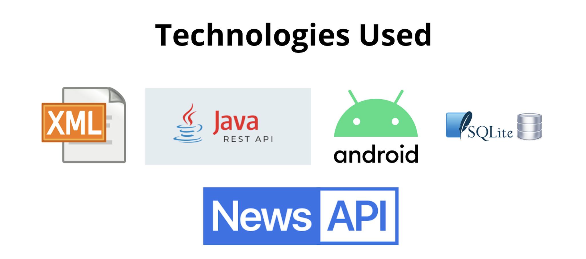
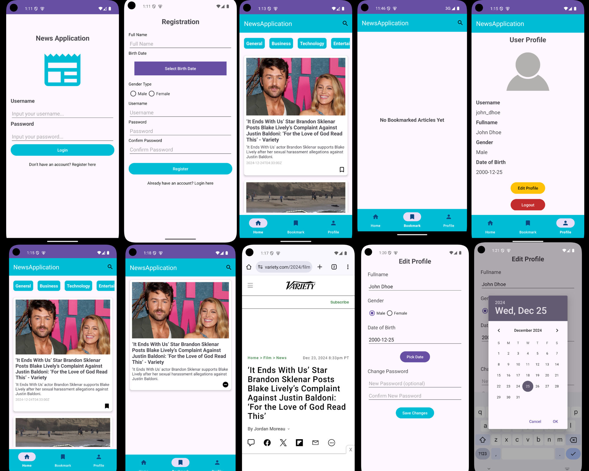
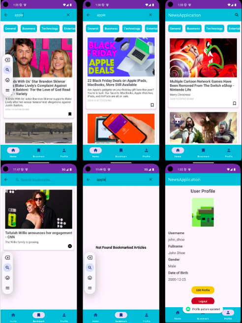

# News Application

This is a News Application built using Java and Android. The application allows users to view news articles, bookmark their favorite articles, and manage their profile.



## Features

- View latest news articles
- Bookmark favorite articles
- Edit user profile
- User authentication

## Technologies Used

- Java
- Android SDK
- SQLite (for local database)
- Gradle (for build automation)


## Project Structure

- `app/src/main/java/com/example/newsapplication/activity/`
  - `MainActivity.java`: Main activity that handles navigation between fragments.
- `app/src/main/java/com/example/newsapplication/fragment/`
  - `HomeFragment.java`: Fragment to display the latest news articles.
  - `BookmarkedFragment.java`: Fragment to display bookmarked articles.
  - `ProfileFragment.java`: Fragment to display user profile.
- `app/src/main/java/com/example/newsapplication/util/`
  - `DatabaseHelper.java`: Helper class for database operations.

## Setup and Installation

1. Clone the repository:
   ```sh
        https://github.com/HanugaFathurC/NewsAppJava.git
2. Open the project in Your IDE.
3. Build the project to download dependencies.
3. Edit API key using your own on strings.xml
4. Run the application on an emulator or physical device:
    - Select an emulator or connect a physical device.
    - If you're using Android Studio, click on the "Run" button.


## Snapshoot Application


